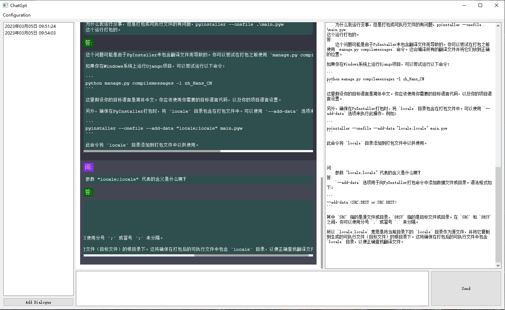
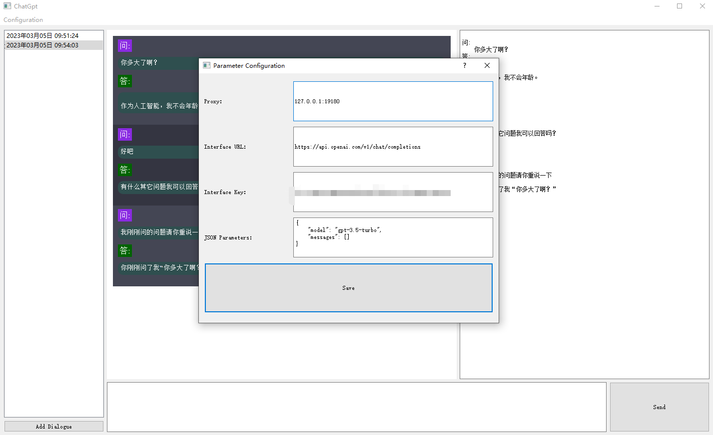
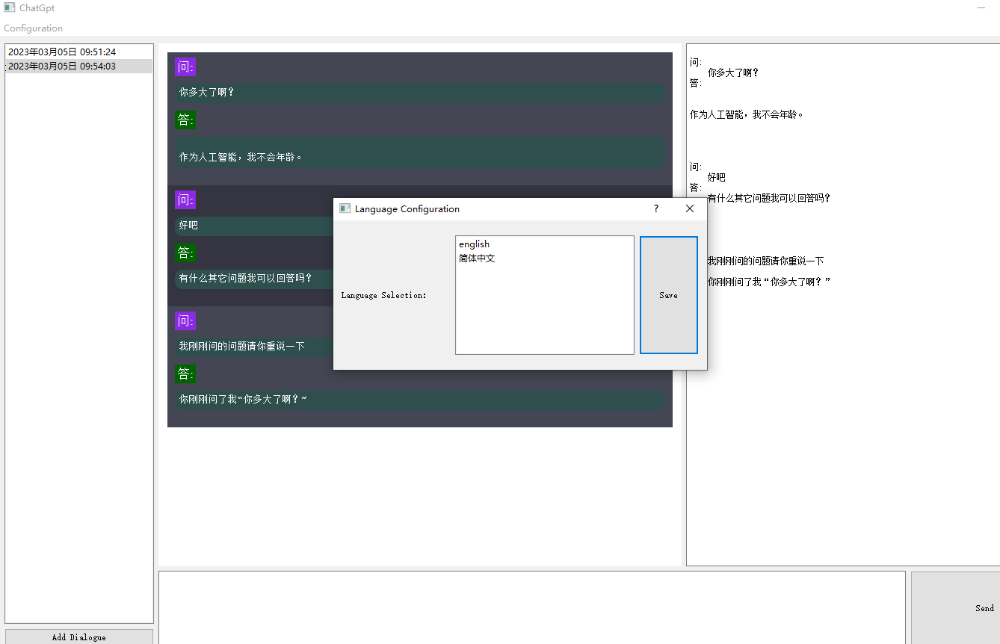
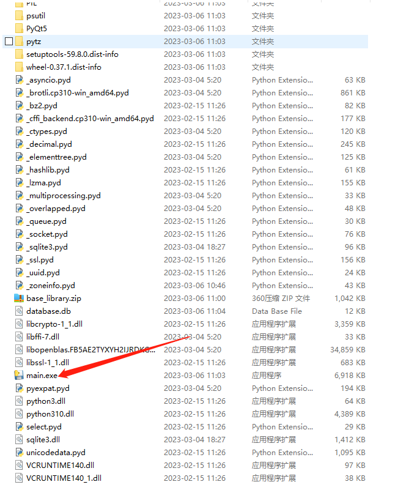

## Function: Integrate ChatGpt Interface

### Project Directory and File Explanation
##### `main.pyw: The main file.`
##### `package_to_exe.bat: A file that can package the project into an executable file.`
##### `docs:Directory containing documentation.`
##### `libs:Directory containing function files.`
##### `locale:Directory containing language files (.po files are language translation files, .mo files are automatically generated files that are only generated when switching languages).`
### Project Startup Interface

### Project Configuration Interface

### Language Configuration Interface

### Executable File
